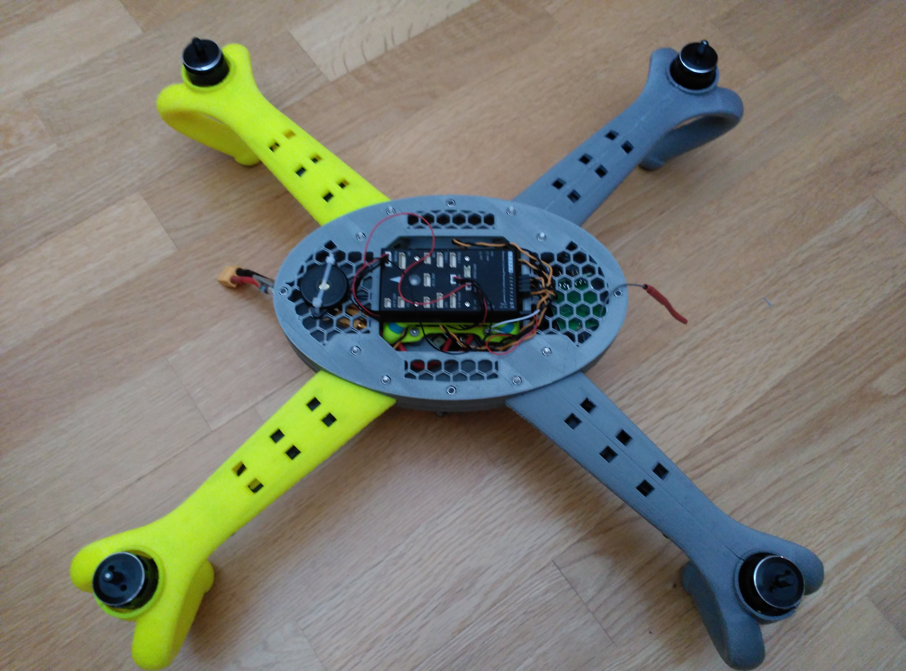
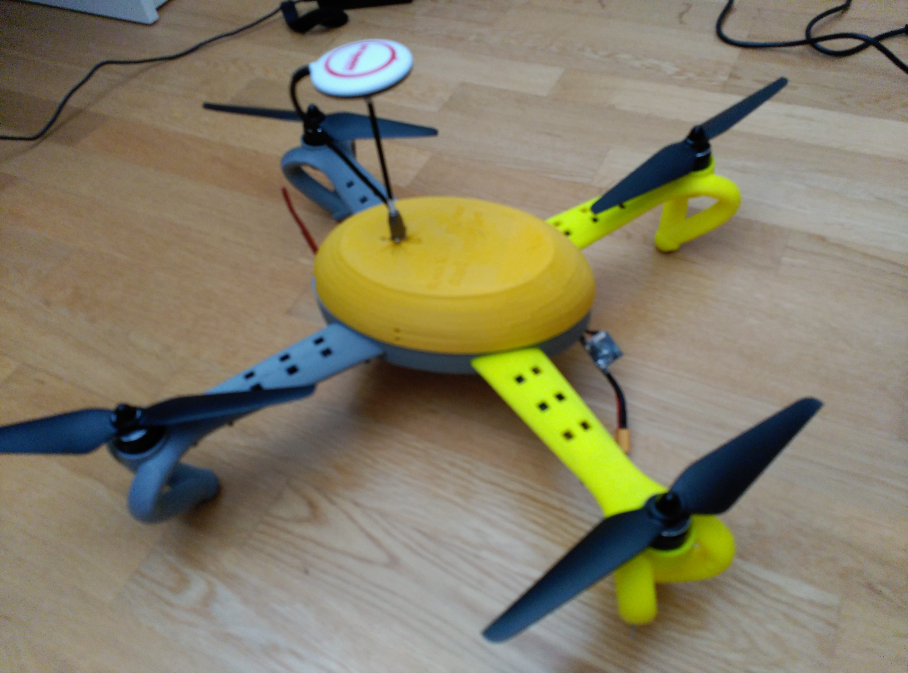

### Multi Copter Project ###

* Created by Diego Viejo

* Date of creation: 09/May/2015

* Distributed under Apache License V2.0

## Description ##

This project is for developing a working multi copter drone chassis. It is fully designed using [OpenScad](http://www.openscad.org "OpenScad"). The project arises after the great quadcopter design of Daniel Norée that you can find [here](http://www.thingiverse.com/thing:793425 "here"). This is robust and aesthetically perfect quad. But it don't fit different electronics nor copter's gears. As Daniel has its design frozen, I decided to make my own and take his as an inspiration. 

I'm trying to keep copter arms fully compatible with those from Daniel's design. So it will be possible to use his arms in my copter body and vice-versa.

My idea is to make this project fully parameterizable: the number of arms, size for the body, battery compartment and so on. 

For some parts of this project I'm using the nice writing routines from Harlan Martin. The complete package can be downloaded from [his repository on github](https://github.com/rohieb/Write.scad "writescad").

## Current Status: Design and Test

* Copter arm is finished. (Already printed and tested)
* Quadcopter body design is finished (beta testing a new design)
* Quadcopter body cover is being designed
* Quadcopter battery compartment is finished (Already printed and tested)

** First Flight Performed!!!! ** (Video coming soon)

## Pictures

.jpg "copter arm")

More pictures can be found at [github repository](https://github.com/dviejo/openMultiCopter/tree/master/Images "github repository")
